# 核心开发库

[](https://mvnrepository.com/artifact/io.zerows/rachel-momo)  [](https://mvnrepository.com/artifact/io.zerows/r2mo-rapid)

> For [Rachel Momo](https://www.weibo.com/maoxiaotong0216)


## 引导

- 文档：<https://www.yuque.com/jiezizhu/r2mo>
    - [>> 快速开始](https://www.yuque.com/jiezizhu/r2mo/pqsn1kv6a6s5otc8)
- 示例：<https://gitee.com/zero-ws/zero-rachel-momo>

---

## 介绍

此库用于统一 `spring-cloud / spring-boot` 提供相对标准化的无业务脚手架，可快速开发和实施相关项目。

### 基础功能

- 统一的 Json 数据结构类型
    - [x] Hutool 中的 `JSONObject/JSONArray`
    - [x] Vertx 中的 `JsonObject/JsonArray`
- 统一的 Io 存储对接访问（存储抽象隔离）
    - [x] 本地文件系统
    - [ ] 🧪 FTP / SFTP
- 统一的异常处理架构
    - [x] Web 异常
    - [x] Remote 服务通信异常（Dubbo专用）
    - [x] Secure 安全异常（Security专用）
    - [x] 异常国际化支持 `ResourceBundle`
    - [x] 🌟 `VertxE / SpringE` 异常定义 -> 统一管理带有错误码的异常处理
- 统一的抽象数据层
    - [x] 标准化的 `CRUD` 管理接口（具有幂等性的代码生成模型）
    - [x] 🌟 JSON 语法的数据库查询分析引擎，简化查询，动态构造。
    - [x] Mybatis Plus
    - [ ] 🧪 Jooq 实现
- 快速编程 🌟
    - [x] 核心组件
        - `Cc` Core Cache / 组件缓存架构：防止组件的重复创建
        - `Fn` 函数式编程接口，兼容 lambda 处理 `Checked` 异常
        - `R / WebRequest / WebResponse` 统一请求响应格式处理
        - `ActResponse` 统一服务级响应处理
        - `BuilderOf` 多元格式转换器，替换传统的 `Set/Get` 方法
    - [x] 核心工具
        - `DBE` / Database Engine，提供数据库统一访问
        - `HFS` / High-Level File System，存储设备统一方法
        - `RFS` / Remote File System，基于底层抽象存储的上传下载
        - `HED` / High-Level Encrypt Decrypt，加解密专用工具类
        - `SPI` / Service Provider Interface，基于 SPI 的核心扩展，可直接使用
- 快速测试框架
    - [x] JUnit 5
    - [x] Mockito
- 基于 Bouncy Castle 的增强安全算法 / 国密算法 🌟
    - [x] 许可管理全流程
    - [x] 数字签名
    - [x] 常用加密、解密核心算法统一接口
    - [x] 大文件上传下载
- 双容器模型
    - [x] Spring Boot 容器（包含 Security部分插件式引入）
    - [x] Vert.x 容器

> 部分实现模型只能二选一！

---

## 整体架构



---

## 参考文档

### 工程初始化

最新版：

```bash
# 安装自动化工具
npm install -g zero-ai
# 初始化 Spring 项目脚手架
ai spring -n app-demo
# 初始化 Zero 项目脚手架（开发中）
ai app -n app-zero
```

### 使用方式

搭建经典的 `-domain/-provider/-api` 的结构，在父 POM 项目中直接继承（推荐）

```xml

<parent>
    <groupId>io.zerows</groupId>
    <artifactId>r2mo-rapid</artifactId>
    <version>${r2mo.version}</version>
</parent>
```

只有使用继承的方式可保证 Maven 的插件版本管理，若插件版本想自定义，直接追加 Maven 的依赖即可。

子项目 `-domain` 中引入

```xml

<dependencies>
    <dependency>
        <groupId>io.zerows</groupId>
        <artifactId>r2mo-spring-boot</artifactId>
        <version>${r2mo.version}</version>
    </dependency>
    <!-- 
    实现部分：
     - r2mo-spring-mybatisplus:         Spring 的 MyBatis-Plus 实现
     - r2mo-spring-json:                Spring 的 Json 序列化配置实现
     - r2mo-typed-hutool:               数据类型的统一实现（Hutool 的 JSONObject）
     - r2mo-io-local:                   存储的核心实现，本地文件存储
    -->
    <dependency>
        <groupId>io.zerows</groupId>
        <artifactId>r2mo-spring-mybatisplus</artifactId>
        <version>${r2mo.version}</version>
    </dependency>
    <dependency>
        <groupId>io.zerows</groupId>
        <artifactId>r2mo-spring-json</artifactId>
        <version>${r2mo.version}</version>
    </dependency>
    <dependency>
        <groupId>io.zerows</groupId>
        <artifactId>r2mo-typed-hutool</artifactId>
        <version>${r2mo.version}</version>
    </dependency>
    <dependency>
        <groupId>io.zerows</groupId>
        <artifactId>r2mo-io-local</artifactId>
        <version>${r2mo.version}</version>
    </dependency>
</dependencies>
```

上述方式是**自选择实现**的模式，若想要快速启动可使用如下依赖：

```xml

<dependencies>
    <dependency>
        <groupId>io.zerows</groupId>
        <artifactId>r2mo-boot-spring-default</artifactId>
        <version>${r2mo.version}</version>
    </dependency>
</dependencies>
```