# 核心开发库

[](https://mvnrepository.com/artifact/io.zerows/rachel-momo)  [](https://mvnrepository.com/artifact/io.zerows/r2mo-rapid)

> For [Rachel Momo](https://www.weibo.com/maoxiaotong0216)

## 介绍

此库用于统一 `spring-cloud / spring-boot` 提供相对标准化的无业务脚手架，可快速开发和实施相关项目。

### 基础功能

- 统一的 Json 数据结构类型
    - [x] Hutool 中的 `JSONObject/JSONArray`
    - [x] Vertx 中的 `JsonObject/JsonArray`
- 统一的 Io 存储对接访问（存储抽象隔离）
    - [x] 本地文件系统
    - [ ] 🧪 FTP / SFTP
- 统一的异常处理架构
    - [x] Web 异常
    - [x] Remote 服务通信异常（Dubbo专用）
    - [x] Secure 安全异常（Security专用）
    - [x] 异常国际化支持 `ResourceBundle`
    - [x] 🌟 `VertxE / SpringE` 异常定义 -> 统一管理带有错误码的异常处理
- 统一的抽象数据层
    - [x] 标准化的 `CRUD` 管理接口（具有幂等性的代码生成模型）
    - [x] 🌟 JSON 语法的数据库查询分析引擎，简化查询，动态构造。
    - [x] Mybatis Plus
    - [ ] 🧪 Jooq 实现
- 快速编程 🌟
    - [x] 核心组件
        - `Cc` Core Cache / 组件缓存架构：防止组件的重复创建
        - `Fn` 函数式编程接口，兼容 lambda 处理 `Checked` 异常
        - `R / WebRequest / WebResponse` 统一请求响应格式处理
        - `ActResponse` 统一服务级响应处理
        - `BuilderOf` 多元格式转换器，替换传统的 `Set/Get` 方法
    - [x] 核心工具
        - `DBE` / Database Engine，提供数据库统一访问
        - `HFS` / High-Level File System，存储设备统一方法
        - `RFS` / Remote File System，基于底层抽象存储的上传下载
        - `HED` / High-Level Encrypt Decrypt，加解密专用工具类
        - `SPI` / Service Provider Interface，基于 SPI 的核心扩展，可直接使用
- 快速测试框架
    - [x] JUnit 5
    - [x] Mockito
- 基于 Bouncy Castle 的增强安全算法 / 国密算法 🌟
    - [x] 许可管理全流程
    - [x] 数字签名
    - [x] 常用加密、解密核心算法统一接口
    - [x] 大文件上传下载
- 双容器模型
    - [x] Spring Boot 容器（包含 Security部分插件式引入）
    - [x] Vert.x 容器

> 部分实现模型只能二选一！

---

## 整体架构

```mermaid
%%{init: {
  'theme': 'base',
  'themeVariables': { 'fontSize': '13px', 'fontFamily': 'arial' },
  'flowchart': { 
    'diagramPadding': 10, 
    'nodeSpacing': 30, 
    'rankSpacing': 40, 
    'curve': 'basis', 
    'htmlLabels': true,
    'useMaxWidth': true
  }
} }%%
graph LR
    %% =========================================================================
    %% [全局样式配置]
    %% =========================================================================
    linkStyle default interpolate basis
    
    %% 定义颜色风格 (对应 Emoji 颜色)
    classDef style_core fill:#fff9c4,stroke:#fbc02d,stroke-width:2px,rx:5,ry:5,color:#333
    classDef style_green fill:#e8f5e9,stroke:#2e7d32,stroke-width:2px,rx:5,ry:5,color:#1b5e20
    classDef style_purple fill:#f3e5f5,stroke:#7b1fa2,stroke-width:2px,rx:5,ry:5,color:#4a148c
    classDef style_blue fill:#e3f2fd,stroke:#1565c0,stroke-width:2px,rx:5,ry:5,color:#0d47a1
    classDef style_boot fill:#37474f,stroke:#263238,stroke-width:2px,rx:5,ry:5,color:#fff
    %% 虚线样式的兼容写法：stroke-dasharray: 5,5
    classDef style_test fill:#e0f2f1,stroke:#009688,stroke-width:2px,rx:5,ry:5,stroke-dasharray: 5,5,color:#004d40

    %% =========================================================================
    %% [第一层：Boot 启动与入口]
    %% =========================================================================
    subgraph Layer_Boot ["🚀 Bootstrap Entry"]
        direction TB
        r-boot-spring-default["🟢 r2mo-boot-spring-default"]:::style_boot
        r-boot-spring["🟢🟡 r2mo-boot-spring"]:::style_boot
        r-boot-vertx["🟣🟡 r2mo-boot-vertx"]:::style_boot
    end

    %% =========================================================================
    %% [独立隔离层：Test 测试支持]
    %% =========================================================================
    subgraph Layer_Test ["🧪 Test Support"]
        direction TB
        r-spring-junit5["🧪 r2mo-spring-junit5"]:::style_test
        r-vertx-junit5["🧪 r2mo-vertx-junit5"]:::style_test
    end

    %% =========================================================================
    %% [第二层：Framework 框架生态]
    %% =========================================================================
    subgraph Layer_Framework ["🛠 Framework Ecosystems"]
        direction TB

        %% --- Spring 家族 ---
        subgraph Box_Spring ["🍃 Spring Family"]
            direction TB
            r-spring["🟢🟡 r2mo-spring"]:::style_green
            
            %% Security 组
            subgraph Box_Security ["🔒 Security Group"]
                r-spring-security["🟢 r2mo-spring-security"]:::style_green
                r-spring-security-oauth2client["🟢 r2mo-spring-security-oauth2client"]:::style_green
                r-spring-security-oauth2["🟢 r2mo-spring-security-oauth2"]:::style_green
                r-spring-security-jwt["🟢 r2mo-spring-security-jwt"]:::style_green
                r-spring-security-ldap["🟢 r2mo-spring-security-ldap"]:::style_green
                
                r-spring-security-email["🟢 r2mo-spring-security-email"]:::style_green
                r-spring-security-sms["🟢 r2mo-spring-security-sms"]:::style_green
                r-spring-security-weco["🟢 r2mo-spring-security-weco"]:::style_green
            end
            
            %% 功能模块
            r-spring-mybatisplus["🟢 r2mo-spring-mybatisplus"]:::style_green
            r-spring-template["🟢 r2mo-spring-template"]:::style_green
            r-spring-excel["🟢 r2mo-spring-excel"]:::style_green
            r-spring-json["🟢 r2mo-spring-json"]:::style_green
            r-spring-cache["🟢 r2mo-spring-cache"]:::style_green
            
            %% 适配器
            r-spring-email["🟢 r2mo-spring-email"]:::style_green
            r-spring-sms["🟢 r2mo-spring-sms"]:::style_green
            r-spring-weco["🟢 r2mo-spring-weco"]:::style_green
        end

        %% --- Vert.x 家族 ---
        subgraph Box_Vertx ["⚛️ Vert.x Family"]
            direction TB
            r-vertx["🟣🟡 r2mo-vertx"]:::style_purple
            
            subgraph Box_Jooq ["🔮 Jooq Group"]
                r-vertx-jooq["🟣 r2mo-vertx-jooq"]:::style_purple
                r-vertx-jooq-generate["🟣 r2mo-vertx-jooq-generate"]:::style_purple
                r-vertx-jooq-jdbc["🟣 r2mo-vertx-jooq-jdbc"]:::style_purple
                r-vertx-jooq-shared["🟣 r2mo-vertx-jooq-shared"]:::style_purple
            end
        end
    end

    %% =========================================================================
    %% [第三层：Implementation 具体实现]
    %% =========================================================================
    subgraph Layer_Impl ["🔧 Implementation & Utils"]
        direction TB
        r-dbe-jooq["🔵 r2mo-dbe-jooq"]:::style_blue
        r-dbe-mybatisplus["🔵 r2mo-dbe-mybatisplus"]:::style_blue
        r-io-local["🔵 r2mo-io-local"]:::style_blue
        r-typed-hutool["🔵 r2mo-typed-hutool"]:::style_blue
        r-typed-vertx["🔵 r2mo-typed-vertx"]:::style_blue
        
        subgraph Box_Xync ["⚡ Xync Services"]
            r-xync-email["🔵 r2mo-xync-email"]:::style_blue
            r-xync-sms["🔵 r2mo-xync-sms"]:::style_blue
            r-xync-weco["🔵 r2mo-xync-weco"]:::style_blue
        end
    end

    %% =========================================================================
    %% [第四层：Kernel 核心基石]
    %% =========================================================================
    subgraph Layer_Kernel ["👑 Core Kernel"]
        direction TB
        r-ams["🟡 r2mo-ams"]:::style_core
        r-dbe["🟡 r2mo-dbe"]:::style_core
        r-io["🟡 r2mo-io"]:::style_core
        r-jaas["🔵 r2mo-jaas"]:::style_blue
        r-jce["🔵 r2mo-jce"]:::style_blue
    end

    %% =========================================================================
    %% [连线关系]
    %% =========================================================================

    %% Kernel
    r-dbe --> r-ams
    r-io --> r-ams
    r-jaas --> r-ams
    r-jce --> r-ams

    %% Impl -> Kernel
    r-dbe-jooq --> r-dbe
    r-dbe-mybatisplus --> r-dbe
    r-io-local --> r-io
    r-typed-hutool --> r-ams
    r-typed-vertx --> r-ams
    r-xync-email --> r-ams
    r-xync-sms --> r-ams
    r-xync-weco --> r-ams

    %% Framework -> Impl/Kernel
    r-spring --> r-ams
    r-spring-mybatisplus --> r-spring
    r-spring-mybatisplus --> r-dbe-mybatisplus
    r-spring-template --> r-spring
    r-spring-excel --> r-spring
    r-spring-json --> r-spring
    
    r-spring-email --> r-spring-template
    r-spring-email --> r-xync-email
    r-spring-sms --> r-spring
    r-spring-sms --> r-xync-sms
    r-spring-weco --> r-spring-cache
    r-spring-weco --> r-xync-weco

    r-spring-security --> r-spring
    r-spring-security --> r-jaas
    r-spring-cache --> r-spring-security
    r-spring-security-email --> r-spring-security
    r-spring-security-email --> r-spring-email
    r-spring-security-sms --> r-spring-security
    r-spring-security-sms --> r-spring-sms
    r-spring-security-weco --> r-spring-security
    r-spring-security-weco --> r-spring-weco
    r-spring-security-jwt --> r-spring-security
    r-spring-security-ldap --> r-spring-security
    r-spring-security-oauth2client --> r-spring-security-oauth2
    r-spring-security-oauth2 --> r-spring-security
    r-spring-security-oauth2 --> r-spring-template

    r-vertx --> r-ams
    r-vertx-jooq-generate --> r-vertx-jooq-jdbc
    r-vertx-jooq-jdbc --> r-vertx-jooq-shared
    r-vertx-jooq-shared --> r-vertx
    r-vertx-jooq-shared --> r-dbe-jooq
    r-vertx-jooq --> r-vertx-jooq-jdbc

    %% Boot
    r-boot-vertx --> r-dbe
    r-boot-vertx --> r-io
    r-boot-vertx --> r-jce
    r-boot-vertx --> r-jaas
    r-boot-vertx --> r-vertx

    r-boot-spring --> r-dbe
    r-boot-spring --> r-io
    r-boot-spring --> r-jce
    r-boot-spring --> r-jaas
    r-boot-spring --> r-spring

    r-boot-spring-default --> r-boot-spring
    r-boot-spring-default --> r-spring-mybatisplus
    r-boot-spring-default --> r-spring-json
    r-boot-spring-default --> r-typed-hutool
    r-boot-spring-default --> r-io-local

    %% --- Test 依赖连线 (使用虚线表示测试范围依赖) ---
    r-vertx-junit5 -.-> r-boot-vertx
    r-spring-junit5 -.-> r-boot-spring
    r-spring-junit5 -.-> r-dbe-mybatisplus

    %% =========================================================================
    %% [背景色块优化]
    %% =========================================================================
    style Layer_Kernel fill:#fffde7,stroke:#fbc02d,stroke-width:2px
    style Layer_Impl fill:#e3f2fd,stroke:#2196f3,stroke-width:2px
    style Layer_Framework fill:#f5f5f5,stroke:#bdbdbd,stroke-width:1px
    style Layer_Boot fill:#cfd8dc,stroke:#607d8b,stroke-width:2px,stroke-dasharray: 5,5
    style Layer_Test fill:#e0f2f1,stroke:#009688,stroke-width:2px,stroke-dasharray: 5,5

    style Box_Spring fill:#e8f5e9,stroke:#a5d6a7,stroke-width:1px
    style Box_Security fill:#c8e6c9,stroke:none
    style Box_Vertx fill:#f3e5f5,stroke:#ce93d8,stroke-width:1px
    style Box_Jooq fill:#e1bee7,stroke:none
    style Box_Xync fill:#ffffff,stroke:#90caf9,stroke-dasharray: 5,5
```



---

## 参考文档

### 工程初始化

最新版：

```bash
# 安装自动化工具
npm install -g zero-ai
# 初始化 Spring 项目脚手架
ai spring -n app-demo
# 初始化 Zero 项目脚手架（开发中）
ai app -n app-zero
```

### 使用方式

搭建经典的 `-domain/-provider/-api` 的结构，在父 POM 项目中直接继承（推荐）

```xml

<parent>
    <groupId>io.zerows</groupId>
    <artifactId>r2mo-rapid</artifactId>
    <version>${r2mo.version}</version>
</parent>
```

只有使用继承的方式可保证 Maven 的插件版本管理，若插件版本想自定义，直接追加 Maven 的依赖即可。

子项目 `-domain` 中引入

```xml

<dependencies>
    <dependency>
        <groupId>io.zerows</groupId>
        <artifactId>r2mo-spring-boot</artifactId>
        <version>${r2mo.version}</version>
    </dependency>
    <!-- 
    实现部分：
     - r2mo-spring-mybatisplus:         Spring 的 MyBatis-Plus 实现
     - r2mo-spring-json:                Spring 的 Json 序列化配置实现
     - r2mo-typed-hutool:               数据类型的统一实现（Hutool 的 JSONObject）
     - r2mo-io-local:                   存储的核心实现，本地文件存储
    -->
    <dependency>
        <groupId>io.zerows</groupId>
        <artifactId>r2mo-spring-mybatisplus</artifactId>
        <version>${r2mo.version}</version>
    </dependency>
    <dependency>
        <groupId>io.zerows</groupId>
        <artifactId>r2mo-spring-json</artifactId>
        <version>${r2mo.version}</version>
    </dependency>
    <dependency>
        <groupId>io.zerows</groupId>
        <artifactId>r2mo-typed-hutool</artifactId>
        <version>${r2mo.version}</version>
    </dependency>
    <dependency>
        <groupId>io.zerows</groupId>
        <artifactId>r2mo-io-local</artifactId>
        <version>${r2mo.version}</version>
    </dependency>
</dependencies>
```

上述方式是**自选择实现**的模式，若想要快速启动可使用如下依赖：

```xml

<dependencies>
    <dependency>
        <groupId>io.zerows</groupId>
        <artifactId>r2mo-boot-spring-default</artifactId>
        <version>${r2mo.version}</version>
    </dependency>
</dependencies>
```

---

### 引导文档

> Spring 部分

- [1.快速开始](docs/01-Environment.md)
- [2.Domain/Entity 书写](docs/02-Domain.md)
- [3.MyBatis-Plus / 代码生成](docs/03-Generator.md)
- [4.异常定义](docs/04-Exception.md)
- [5.查询引擎 DBE](docs/05-DBE.md)

Service/Controller 部分的编程代码可直接参考生成代码，也可自己编写！

---